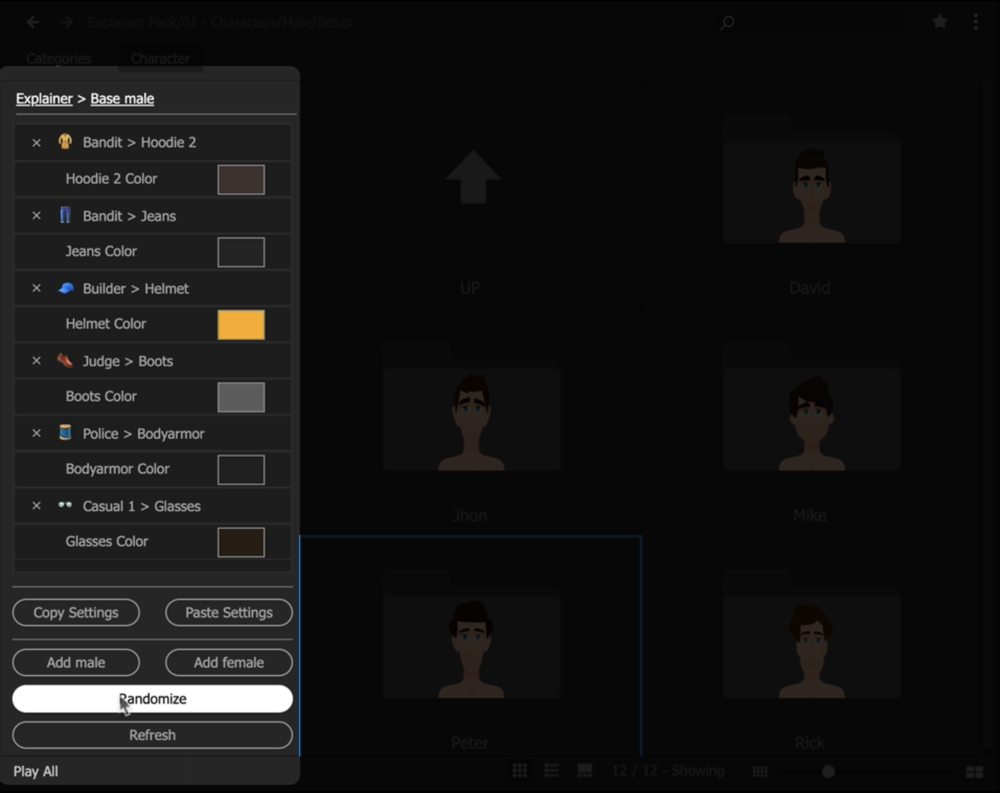

Aeviewer API
========

## Usefull Links
* [CEP Starter guide](https://github.com/Adobe-CEP/Getting-Started-guides)
* [CEP After Effects sample](https://github.com/Adobe-CEP/Samples/tree/master/AfterEffectsPanel)
* [JSX guide](https://ae-scripting.docsforadobe.dev/)

### Settings panel for the packs

If you will open a pack inside Aeviewer and it would have such a panel,
a new tab will appear with a name `Project Settings`.
You can use HTML, CSS, JS and JSX to create such panels.



---------------

Create a folder `(Settings)` inside the root folder of your pack.
Add the following files inside a new folder:
* index.html
* script.js
* style.css
* hostscript.jsx

The first three files are responsible for the UI of the panel and its logic.
`hostscript.jsx` is the part that will communicate with Aeviewer, use import functions, and do some processing of projects/comps.

**IMPORTANT NOTE: Please use the same names as above, otherwise Aeviewer wouldn't be able to eval your panel.**

---------------

Files structure example:
```shell
My package folder
│
├── (Settings)
│   ├── index.html
│   ├── style.css
│   ├── script.js
│   └── hostscript.jsx
└─ Titles
    ├── titles 01.aep
    ├── titles 02.aep
    ├── titles 01.png
    ├── titles 02.png
    ├── titles 01.mp4
    ├── titles 02.mp4
    └── ...
```
---------------

### Invoke JSX (Extendscript)

To invoke your own ExtendScript function, first of all write this code in your JS file:
```js
var csInterface = new CSInterface();
```

Then you can call evalScript method and pass your parametrs to JSX function:
```js
csInterface.evalScript('testFunction("' + firstParametr + '", "' + secondParametr + '")', function(res) {
    //callback after JSX
});
```

### Write your HTML code without

```html
<!DOCTYPE html>
<html>
</html>
```

### For scrollable elements set class to "scrollable":

```html
<div class="scrollable">
</div>
```

Your elements inside would be automatically scrollable.

Available JSX functions
========

### Checking if Aeviewer API is available:

```javascript
var isAeviewerRunning = (typeof AEVIEWER !== 'undefined');

if (isAeviewerRunning) {
    alert("API version: " + AEVIEWER.version);
} else {
    alert("Aeviewer is not running");
}
```

### JSON

JSON function is available natively.
Use JS0N (sezo instead of big O) to parse or stringify your objects.

```javascript
JS0N.stringify(data);
JS0N.parse(string);
```

### AEVIEWER

```javascript
  /**
   * Show alert with trial version
   * Useful when you would like customers to try a trial version first
   * @param header    - Alert's header
   * @param content   - Alert's content
   * @param img       - Path to local image or URL
   * @param url       - URL to package
   * @returns boolean, always true
   */

AEVIEWER.alertTrial(header, content, img, url);

```
<details>
  <summary>Trial alert example</summary>


</details>


```javascript

/**
 * Imports or opens file inside the current project
 * @param   {String} filepath     Path to the file
 * @param   {String} importType   Import type of the file
 * @returns {boolean} true | false
 */

/*
 * Available importType options:

    - "add"                  Just add file to project
    - "open"                 Open project or media in the viewer
    - "onlyopen"             Only open file. The same behavior as "Open" command
    - "import-only"          Only import file to the current project
    - "import-and-replace"   Import file and replace the selected layers with imported file\ or composition if it's aep file
    - "import-and-comp"      Import and create a pre-composition from file\comp
*/


AEVIEWER.importFile(filepath, importType);

```


Import file extensions supported by FREE version:
```
"ffx", "aep", "aet", "aepx", "jsx", "jsxbin", "json", "mgjson", "csv", "tsv", "txt", "prst", "expr", "prproj"
"nef", "exr", "tif", "dpx", "pam", "pbm", "pcx", "ptx", "jpg", "jpeg"
"webm", "mkv", "3gp", "avi", "mov", "m4v", "apng", "mxf", "mogrt"
"aac", "ac3", "aif", "aiff", "m4a", "mp2", "mp3", "mpa", "wav", "wma", "flac", "ogv", "ogm", "ogg", "oga"
"gif", "mp4", "png"
"ttf", "otf", "c4d", "ai", "eps", "psd"
```

Import file extensions supported by PRO version:

```
"ffx", "aep", "aet", "aepx", "jsx", "jsxbin", "json", "mgjson", "csv", "tsv", "txt", "prst", "expr", "prproj", "mogrt"
"nef", "exr", "tif", "dpx", "pam", "pbm", "pcx", "ptx", "jpg", "jpeg"
"webm", "mkv", "3gp", "avi", "mov", "m4v", "apng", "mxf", "mogrt"
"aac", "ac3", "aif", "aiff", "m4a", "mp2", "mp3", "mpa", "wav", "wma"
"gif", "mp4", "png", "webp"
"ttf", "otf", "c4d", "ai", "eps", "psd"
```


```javascript
/**
 * Create a dialog window with color picker
 * @returns RGB or -1 if user clicked "Cancel"
 */

AEVIEWER.colorPicker();

```
```javascript
/**
 * Execute command in the system terminal
 * @param cmd  - String with the command
 * @returns String with the answer from command line
 */

AEVIEWER.systemCall(cmd);
```


## Pre-import and post-import actions

Create `aev_before.jsx` and `aev_after.jsx` inside the folder with importing files to controll before and after import actions.

`aev_after.jsx` example:

```javascript

(function () {

    try {

        if (!app.project.selection.length || (!app.project.activeItem)) return !!alert("Please, open the composition and select layers");

        app.beginUndoGroup("aev_after");

        var importedProject = app.project.selection[app.project.selection.length - 1];

        var myComp = app.project.activeItem;
        var layer = myComp.selectedLayers[0];

        // Do anything with myComp for example add 'Levels' effect

        layer("ADBE Effect Parade").addProperty("ADBE Easy Levels2");


    } catch (e) {

        alert(e.toString() + "\nScript File: " + File.decode(e.fileName).replace(/^.*[\|\/]/, '') +
            "\nFunction: " + arguments.callee.name +
            "\nError on Line: " + e.line.toString());

    } finally {
        app.endUndoGroup();
    }

})()

```
